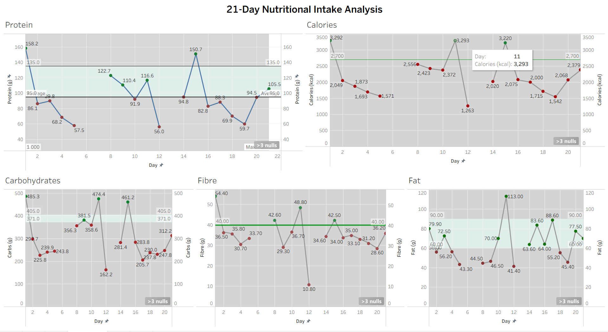

# 21-Day Nutritional Intake Analysis

## Project Overview

This project analyses my nutritional intake over a 21-day period using food intake data and data visualization.

The analysis focuses on five key nutritional metrics:

- Protein
- Fibre
- Fat
- Carbohydrates
- Calories

The objective was to compare my daily intake against recommended nutritional targets and identify patterns in my intake across the 21-day period.

---

## Objectives

- Track daily intake of major nutrients.
- Compare actual intake with recommended daily targets.
- Identify days where nutritional targets were met or missed.
- Identify significant low-intake and high-intake zones.
- Visualize nutritional trends over 21 days.
- Build an interactive Tableau dashboard for easier interpretation.

---

## Tools Used

- **Microsoft Excel** – Data organization and preparation
- **Tableau Public** – Data visualization and dashboard creation
- **GitHub** – Project documentation and version control

---

## Dataset

The project contains five separate datasets:

| Dataset | Metric |
|---|---|
| `protein_21_days_numeric_data.csv` | Protein intake (g) |
| `fibre_21_days_numeric_data.csv` | Fibre intake (g) |
| `fat_21_days_numeric_data.csv` | Fat intake (g) |
| `carbohydrates_21_days_numeric_data.csv` | Carbohydrate intake (g) |
| `calories_21_days_numeric_data.csv` | Calorie intake (kcal) |

Each dataset contains the recorded intake for each day of the 21-day period.

Some days were not recorded. These observations were kept as missing values rather than being treated as zero intake.

---

## Nutritional Targets

The Tableau dashboard compares the recorded intake against target/reference values.

| Nutrient | Target / Reference |
|---|---:|
| Protein | 95–135 g/day |
| Fibre | 40 g/day |
| Fat | 60–90 g/day |
| Carbohydrates | 371–405 g/day |
| Calories | ~2700 kcal/day |

For nutrients with a target range, the Tableau dashboard uses a shaded target band.

For nutrients with a single reference value, a reference line is used.

---

## Data Visualization

The final Tableau dashboard contains five line charts:

### 1. Protein
Tracks daily protein intake and compares it with the target range.

### 2. Calories
Shows daily calorie intake against the approximate daily energy requirement.

### 3. Carbohydrates
Shows daily carbohydrate intake and its position relative to the target range.

### 4. Fibre
Shows daily fibre intake compared with the 40 g/day reference.

### 5. Fat
Shows daily fat intake compared with the 60–90 g/day target range.

The dashboard also uses conditional colours to distinguish observations that fall below the target from those that meet the target.

---

## Dashboard

The final Tableau dashboard provides a single view of all five nutritional metrics across the 21-day period.



---

## Analysis Approach

The analysis was performed in the following steps:

1. Recorded food intake over a 21-day period.
2. Organized the nutritional data into separate datasets.
3. Cleaned the datasets and converted the day values into numeric format.
4. Kept unrecorded days as missing values instead of assigning zero intake.
5. Imported the datasets into Tableau.
6. Created individual line charts for each nutrient.
7. Added target/reference lines and shaded target bands.
8. Used conditional status fields to visually distinguish target achievement.
9. Combined the five visualizations into one dashboard.
10. Analysed the results by day of the week to identify recurring patterns.

---

## Missing Data

A small number of observations were not recorded during the 21-day period.

These values were kept as missing/null values in Tableau rather than being converted to zero, because a missing record does not mean that no food was consumed.

For weekday-level interpretation, observations from the same weekday in other weeks were used where applicable to understand recurring weekday patterns.

---

## Assumptions

The nutritional calculations were based on recorded food quantities and standard nutritional reference values.

Key assumptions included:

- Rice, dal and legumes were generally treated as cooked weights.
- Curries were treated as cooked/prepared foods.
- Standard homemade roti sizes were assumed where exact dimensions were unavailable.
- Standard whole eggs were assumed.
- Regular dairy products were assumed unless otherwise specified.
- Paneer was treated as regular/full-fat paneer.
- Chicken was treated as cooked chicken.
- Moderate cooking oil was assumed where the quantity was not specified.
- Standard-sized dates and other foods were assumed where exact size was unavailable.
- Nutritional values were estimated using standard nutritional databases/reference values.

---

## Limitations

- Some meals or quantities were not recorded.
- Cooking oil quantities were not always available.
- Actual portion sizes can vary considerably.
- Homemade and restaurant recipes can have different nutritional compositions.
- Brand-specific nutritional differences were not always available.
- Nutritional database values represent estimates rather than laboratory measurements.
- Some food items had incomplete descriptions, requiring standard portion assumptions.
- Missing days reduce the completeness of the 21-day comparison.

---

## Tableau Workbook

The complete Tableau packaged workbook is included in this repository:

`21-Day_Nutritional_Intake_Analysis.twbx`

The `.twbx` file contains the Tableau workbook and its associated packaged data, allowing the dashboard to be opened and explored in Tableau.

---

## Repository Structure

```text
21-day-nutritional-intake-analysis/
│
├── 21-Day_Nutritional_Intake_Analysis.twbx
├── 21-day-nutritional-dashboard.png
│
├── protein_21_days_numeric_data.csv
├── fibre_21_days_numeric_data.csv
├── fat_21_days_numeric_data.csv
├── carbohydrates_21_days_numeric_data.csv
├── calories_21_days_numeric_data.csv
│
├── README.md
└── .gitignore
